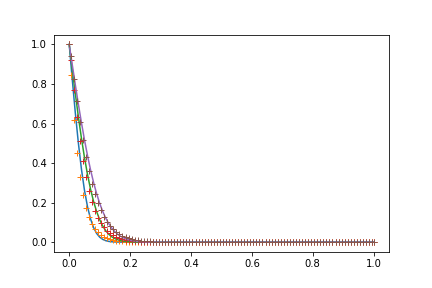
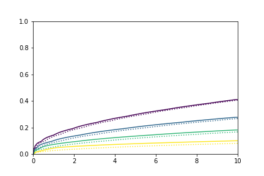

This is a simple Python Jupyter notebook with step-by-step explanations to have finite volume derivations for 1-D pure diffusion and two-dimensional thermal layer development. It also covers the analytical derivation of solutions to both equations. 

The comparison is shown below:
* One-dimensional diffusion solved on two-dimensional grid

 
* Two-dimensional thermal layer development

